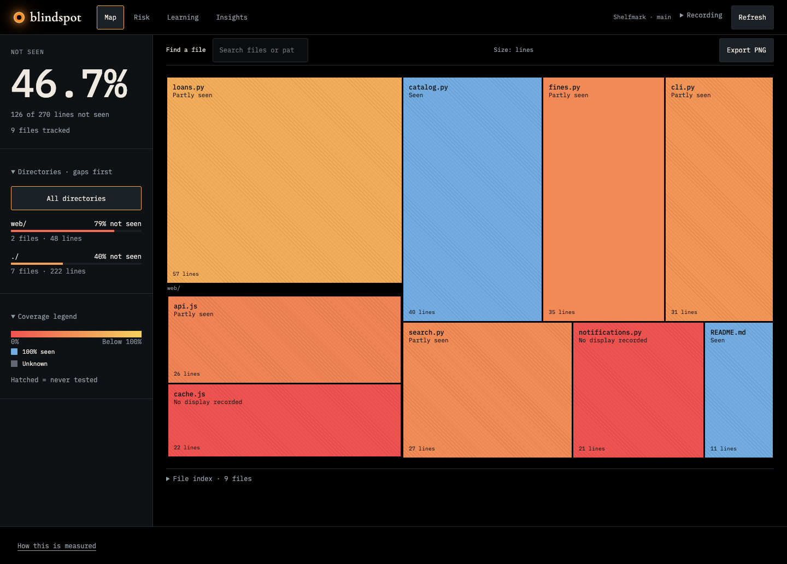
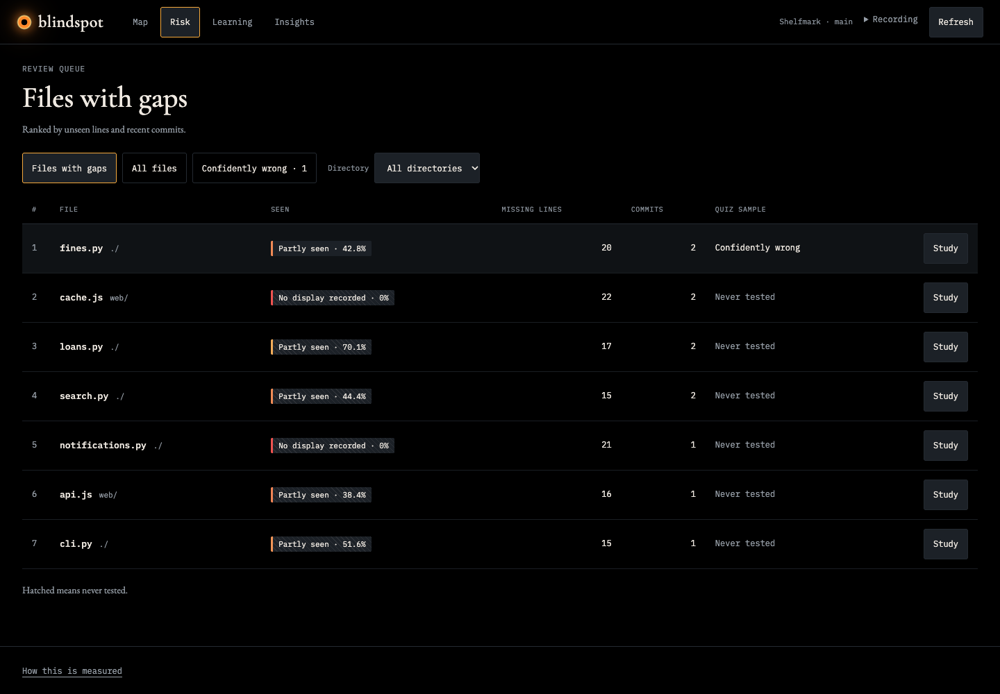
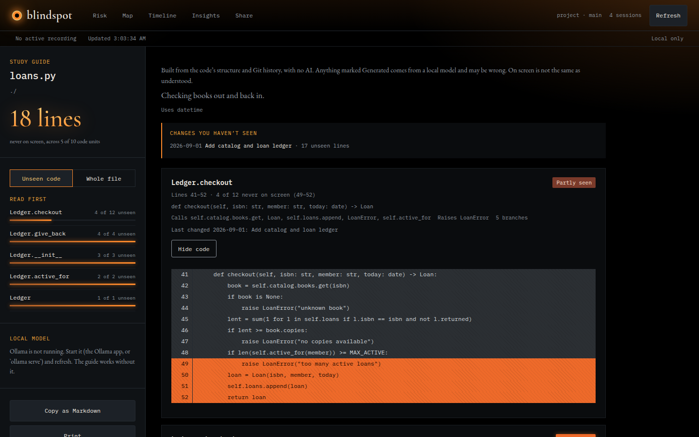
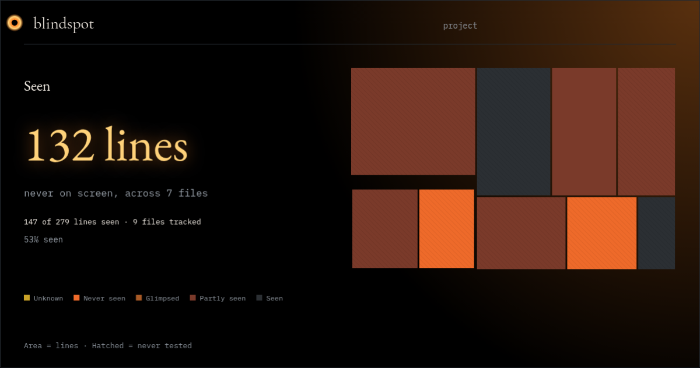
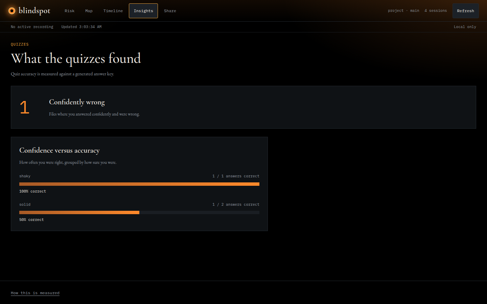

# Blindspot

**See how much of your code you have actually seen.** When an AI agent writes a lot of your
project, it is easy to ship code you never looked at. Blindspot runs locally next to VS Code,
records which lines were on screen, and shows what is still a blind spot, with a study guide
for the parts you skipped. Display evidence is a starting point for awareness, not proof of
reading or understanding. Recording stays on your machine. Copying a quiz prompt into another service shares the selected code.



| | |
|---|---|
|  |  |
| **Risk**: files ranked by unseen lines and recent commits | **Study guide**: unseen code units, last changes, optional local-model explanations |
|  |  |
| **Export PNG**: local share card from Map | **Insights**: quiz results, including confident wrong answers |

## Install the packaged preview

Supports **macOS/Linux**, Python 3.11+, Git and VS Code 1.95+. Windows and remote
workspaces are unsupported. Install the VSIX plus the companion Python wheel;
the wheel includes the dashboard and bundled fonts. Node is needed only to build.

Follow [the public setup and installed-package checklist](docs/release.md).
Run **Blindspot: Connect to Receiver** and choose the connection file printed by
the receiver. No F5 configuration or pilot directories are required.

Packages are prepared locally; no Marketplace or GitHub release is published yet.
Recording saves supported source snapshots, including unopened files, in your
chosen state directory. It considers at most 500 file candidates and skips files
over 256 KiB. Only visible lines gain display credit. Earlier work is unknown.
Delete the state directory after stopping recording and the receiver to remove
saved source and activity. Quizzes and optional local explanations are unverified;
quiz passes do not lower a whole file's priority.

## Try it in two minutes

For contributors: install Node 22+, Python 3.11+ and Git, then run `python3 -m venv .venv`. No VS Code needed for this sample. This builds an invented sample project with recorded activity:

```sh
npm --prefix dashboard ci && npm --prefix dashboard run build
python3 scripts/seed_demo.py                      # writes sandbox/demo
.venv/bin/python -B -m blindspot observer serve \
  --workspace sandbox/demo/project --state-dir sandbox/demo/state --port 7777
```

Open <http://127.0.0.1:7777>. Map opens first, with the percentage of lines not seen and the underlying line counts. Search for files, select directories to filter the map, or choose **Export PNG** for a share card. (Screenshots above come from this demo.) To record your own
project, run the VS Code extension and point the receiver at it as described below.

**Status: a local presentation MVP.** The VS Code extension, local receiver, SQLite storage and
React dashboard work end to end (Risk, Map, Learning, Insights, Share card, per-file study guide).
Scope and decisions are in [the short v1 design](DESIGN.md) and
[the simplified roadmap](reports/roadmap-proposal.md); [the agent handoff](context_handoff.md)
has the run checklist.

The localhost site is the main demo surface; VS Code supplies observations and
recording controls. Display evidence does not prove reading or understanding.
Quizzes support pasted model replies; automatic local quiz generation is deferred.

For the existing 0.3 development build, see [setup instructions](reports/observer-03.md#load-this-build).
Its longer acceptance matrix is historical guidance, not a prerequisite for the
presentation MVP. Python 3.11+ and Git are required; F5 is only for extension development;
no runtime Python dependencies or model session are required.

The CLI documentation below describes the earlier transcript/evidence and review
workflow. Those commands and records remain available separately from the demo.

## Local setup and hosting

Requirements: Python 3.11+, Node 22+, Git. Run these commands from the repository
root. Create the virtual environment once if `.venv` does not already exist:

```sh
python3 -m venv .venv
```

Install frontend dependencies and build, then host the dashboard in your terminal:

```sh
npm --prefix dashboard ci
npm --prefix dashboard run build
.venv/bin/python -B -m blindspot observer serve \
  --workspace /absolute/path/to/your-git-project \
  --state-dir /absolute/path/outside-the-project/blindspot-state \
  --port 7777
```

Leave the server terminal running and open **http://127.0.0.1:7777**. Ctrl+C stops
it. This hosts the dashboard on your machine only. To use another project, replace
`--workspace` with its Git checkout and choose a separate `--state-dir` outside
that checkout. The extension must use that server's `connection.json`.

### Updating the frontend

After changing frontend files or pulling updates, run this in a second terminal:

```sh
npm --prefix dashboard run build
```

Then refresh the browser. Frontend changes do not require restarting Python.
Run `npm --prefix dashboard ci` first if dependencies changed.

For automatic rebuilds while editing, keep this running in the second terminal:

```sh
npm --prefix dashboard run build -- --watch
```

Wait for the build to finish, then refresh the browser; this is build watching,
not browser hot reload. Stop/restart the server after changing Python code or its
workspace/state options. Keep the same state directory to preserve observations
and quizzes.

`scripts/demo.sh` does both steps. The built dashboard (`blindspot/observer/dashboard_dist/`) is
not committed, so after `git pull` or a branch switch you must rebuild or the old UI keeps serving.

Open **http://127.0.0.1:7777**. If an older receiver is running, stop it with
Ctrl+C in its terminal before restarting. The extension reconnects using the
same `connection.json`; select it with **Blindspot: Connect to Receiver**.
The extension also provides a **Blindspot** activity-bar sidebar, themed like the dashboard with bundled fonts and a colored coverage grid, with unseen coverage,
changed unseen lines, file shortcuts, recording controls, and **Full dashboard**.
After updating the extension, reload VS Code (restart F5 only during development), then click the Blindspot eye icon in the activity bar.
It uses the same connection file and receiver; it does not start recording by itself.
Start recording in VS Code to add observations. The dashboard refreshes every
10 seconds and has a manual Refresh button.

The dashboard never writes observed source. State must stay outside the observed
workspace. `/inspector` retains the earlier diagnostic interface, and the VS Code
overview remains available. Fonts, scripts and assets are bundled; runtime
requests stay on localhost. The site has no account or login.

Review serves existing validated questions only. Add
`--review-state-dir /absolute/path/to/existing-review-state` to connect a separate
`reviews.json` store for the **same workspace**. Otherwise it reads review state
in the observer state directory. No matching unanswered quiz means the Review
action is unavailable until a quiz is imported. Practice quizzes do not change display percentages or whole-file priority.

**Study guide.** Choose **Study** in Risk or **Study unseen code** in file detail to
open a lesson. File detail puts actions above the source, with secondary evidence
and unseen-section links under disclosures. **Full study guide** in a lesson opens
an outline of all code units, with expandable code and metadata. Markdown copy and
print are under **Export guide**. The guide uses the code's structure and Git history.

**Quizzes from any chat model.** On the full guide page, **Copy prompt** on a code unit copies a
prompt to paste into Claude, ChatGPT or any chat model. Paste its JSON reply back, and Blindspot
checks the shape, the cited lines and the commit it is tied to, then opens the existing review
screen. Quizzes are tied to committed code (commit first), cover 10 to 300 lines, and carry an
answer key written by the model and not verified, so a question that looks wrong can be reported
after you finish, which removes that quiz. Blindspot itself makes no model call for this.

**Learning.** The Learning tab lists files with unseen lines and opens a lesson
for one code unit at a time. Switch between Code, Quiz, and Explain; use
Previous/Next to move between units. Code and paste-in quizzes work without
Ollama. Browsing lessons does not claim understanding or change VS Code display
evidence; completed quizzes use the existing review rules.

**Visibility colors.** Zero lines seen is red. Partial coverage shifts from red
to yellow in proportion to the lines seen. Only full coverage is blue; unknown
files are neutral. Colors indicate display evidence, not quiz accuracy.

**Agent support.** The VS Code dashboard works alongside any coding agent that
changes files in the watched local workspace, including terminal-based agents.
It observes file changes and editor visibility without identifying the author.
The older transcript-analysis CLI separately supports Claude Code logs only.
Code shown in a terminal or another application does not count as VS Code
source-editor visibility.

**Changed code.** File chips include the seen percentage. Risk and Learning show
a changed-lines badge when added or replaced lines lack display evidence, even
if the label stays Partly seen. File detail highlights those lines and offers
**Show changed lines**. Comparison requires an earlier version with on-screen
activity; opening the changed lines in VS Code removes their badge contribution.

### Test quiz creation with ChatGPT

Use the seeded sample project from **Try it in two minutes** for a disposable
trial. It already has committed code and invented activity; its prewritten quiz
does not count as a generated-model test.

1. Open **Learning**, find `notifications.py`, and choose **Study**.
2. Choose the `render` unit in the outline, then the **Quiz** tab.
3. Click **Copy prompt** (or **Make another quiz → Copy prompt** when one is ready). Paste the prompt into a fresh ChatGPT
   conversation and retain the exact reply.
4. Paste the unchanged reply into **Model reply**, then click **Create quiz**.
   Preserve any error or warning before repairing the reply.
5. Repeat for `fines.py` → `fine_for` in a fresh ChatGPT conversation.
6. Check each answer key against the numbered code, then click **Start quiz**.
   Submit an option and confidence for every question. Source state and risk
   should stay hidden during the quiz; keys appear after completion.
7. Return to Risk. A passing practice sample leaves visibility counts and
   whole-file priority unchanged. Insights links to completed results.
8. For a faulty key, use **This answer key looks wrong** after completing the
   quiz. Reporting removes the whole set from effective results and keeps its
   history. Do this only for a genuinely faulty key or a labelled workflow test
   in disposable state.

Quizzes require committed code; files with unsaved or uncommitted changes must
be committed before quiz creation. Ollama is not needed for this paste-in flow.
Only the sample code you manually paste is sent to ChatGPT. For debugging,
retain the raw reply, ChatGPT model name, import errors/warnings, and final result.

**Optional local explanations.** If [Ollama](https://ollama.com) is running, the full guide page
gets an **Explain** button on each code unit and **Summarize this file**. Install a model once
(for example `ollama pull qwen2.5-coder:7b`; any chat model works) and pick it in the sidebar.
Only the selected unit's code, its unseen line ranges and its last commit message are sent, to
a loopback endpoint only (`--ollama-url` rejects anything off this machine). Answers are cached
in the observer state folder, labelled as generated and unverified, and the guide works
the same without them. To go back to the version before this feature, check out the commit
`f21ab92` (tagged `pre-ollama` where the tag could be pushed).

The [data contract and design adaptations](reports/dashboard-contract.md) explain
what is measured, inferred, and unavailable. Check the implementation with:

```sh
npm --prefix dashboard test
npm --prefix dashboard run test:browser
.venv/bin/python -B -m unittest tests.test_dashboard -v
```

The browser check uses installed Google Chrome and disposable fixture data.
It saves screenshots and a PNG under ignored `reports/local/dashboard-checks/`.

## Run from this checkout

```sh
python3 -m blindspot doctor /path/to/repository
python3 -m blindspot scan /path/to/repository
python3 -m blindspot brief /path/to/repository/src/example.py
```

Evidence commands read Claude Code transcripts from `~/.claude/projects/`. Application
configuration and source inventories go to `~/.blindspot/prototype.json`.
Scanning never changes the inspected repository or Claude's files. Reports read
file contents from captured Git HEAD, including when the working tree is dirty.

Use `--read-only` with `scan`, `doctor`, `brief`, or an identity listing to read
existing configuration without creating/updating application state. It rejects
`link` and identity changes. Python's `-B` also suppresses interpreter bytecode
cache writes:

```sh
python3 -B -m blindspot doctor /path/to/repository --read-only
```

State stays outside the inspected checkout. A dot-prefixed folder is hidden in
some file browsers but is not automatically ignored by Git; creating one would
also be a write. Blindspot does not create a metadata folder in scanned repos.

For an isolated state directory or a fixture corpus:

```sh
python3 -m blindspot doctor /path/to/repository \
  --state-dir /tmp/blindspot-state \
  --sessions-dir /path/to/claude/projects \
  --json \
  --now 2026-10-02T12:00:00-05:00
```

Evidence `--json` includes local paths, Git identities, and evidence references.
Keep these reports private when sharing a checkout. Transcript prose, edit
payloads, and shell commands are not retained. Evidence reports do not include
source code; `target export` explicitly exports selected code, and imported
questions, answer keys, source rationales, and answers are stored in `reviews.json`.

The package also defines a `blindspot` entry point for editable installation:

```sh
python3 -m venv .venv
.venv/bin/python -m pip install -e .
.venv/bin/blindspot doctor /path/to/repository
```

Installation needs setuptools as a build dependency. Run module commands without
installing when offline. The distribution is named `blindspot-local`; it is not
published to a package index.

## Evidence and configuration

`doctor` shows four file evidence categories, separate commit timing inference,
raw mode counts, unresolved operations, coverage diagnostics, a review queue,
and sensitivity to 0/2/24/72-hour grace periods. Results describe activity at a
path, even if the edit was reverted or came from another branch. A passed tool
result establishes a recorded edit; missing results remain unresolved.

Doctor distinguishes recorded edit entries from operation counts after consistent
copies are coalesced. Cross-source copies must match the tool ID, timestamp, cwd,
tool, and hashed mutation input, with agreeing results and policy metadata. Every
call/result reference remains in the event's `observations`. Result pairing always
happens within each source. Missing results are never filled from another source;
contradictory copied results stay unresolved. Different inputs, missing timestamps,
and differing policy metadata prevent silent merging. Counts are conservative
observations, not a guaranteed census of unique real-world operations.

No supported associated transcripts means **analysis unavailable**, with no
provenance rates. No configured/confirmed Git identity leaves identity-dependent
files unresolved. Renames and delete/recreate histories have ambiguous lineage.
Nested/subagent sources are inventoried but currently unsupported; their results
are not paired with tool calls from unrelated main sources.

The initial review queue orders agent-observed/unresolved paths by 90-day churn,
then path. Reports now show current passing target samples alongside evidence;
review data does not change the earlier CLI queue ordering. The React dashboard
uses its own verification-aware priority policy. Churn is activity, not operational risk.

```sh
python3 -m blindspot identity /path/to/repository
python3 -m blindspot identity /path/to/repository --confirm alias@example.com
python3 -m blindspot identity /path/to/repository --remove wrong@example.com
python3 -m blindspot link /path/to/session.jsonl /path/to/repository
```

The configured identity is accepted initially. Other historical identities are
listed for explicit confirmation; names do not automatically confirm colleagues.
Removing an incorrectly configured identity is persistent until confirmed again.
Explicit links survive rescans and are identified in reports. A manual link maps
paths relative to the transcript's first recorded cwd to the selected checkout;
use it only when that origin is the intended checkout root. General moved-checkout
and nested-origin reconciliation remains future work.

For a moved checkout, `--source-root OLD_PATH` temporarily maps all main
transcripts whose first recorded cwd matches that old root. It accepts only
sources whose other cwd contexts stay within that origin, is repeatable, and
never saves links. No source directory names are decoded into checkout identities.
For the validated Collatz checkout:

```sh
.venv/bin/python -B -m blindspot doctor \
  /Users/mayankjain/College/Fall2026/SWE_logs/cs373-collatz \
  --read-only \
  --state-dir reports/local/collatz-read-only-state \
  --source-root /Users/mayankjain/College/Fall2026/cs373_MAIN/cs373-collatz
```

Temporary mappings are also available to `scan` and `brief`. Default scans still
save inventories and identity configuration; add `--read-only` to suppress those
writes. A read-only run cannot establish a new saved inventory for future
source-loss detection, but it can compare against an existing one.

Exclusions can be extended with `--exclude PATTERN`; `--include PATTERN` overrides
a matching path exclusion. `--no-default-exclusions` replaces built-in patterns.
Binary/non-UTF-8 blobs, symlinks, and submodules remain excluded. Built-in patterns
are listed in the report policy, so a denominator can be checked.

Phase 1 reparses transcripts on every scan. It retains source inventories to
report known source disappearance. It does not silently forget missing sources
on subsequent scans. Rewritten repository identity requires explicit reconciliation
or a separate state directory; no user identity/link records are dropped.

## Terminal review experiment

Start the prepared Collatz exercise with the command in
[the Phase 2 pilot](reports/phase2-pilot.md). The original five-question exercise
has one completed workflow-test attempt; the cycle-length follow-up has one
completed understanding review, and the cache-test-design set remains ready.
Quiz generation is paused while the approved visibility roadmap is implemented.
The pilot also
provides the JSON contract and an authoring prompt.

For another target, export committed source explicitly to a location outside the
inspected checkout, author a set, and import it:

```sh
python3 -B -m blindspot target export /path/to/repository/src/example.py \
  --start 20 --end 80 --name example-function --output /tmp/target.json
python3 -B -m blindspot quiz import /tmp/quiz.json --state-dir /tmp/blindspot-review
python3 -B -m blindspot quiz review SET_ID --state-dir /tmp/blindspot-review
python3 -B -m blindspot quiz status /path/to/repository \
  --state-dir /tmp/blindspot-review --read-only
```

Targets contain at least 10 lines; each exported target/context block is limited
to 300 lines and 16 KiB. `--context FILE` exports a bounded whole context file;
repeat `--context-range FILE START END` to select context spans. No model calls
are made automatically. Import checks shape, citations, and revision bindings;
it cannot prove the generated key is correct.

For this pilot, the assistant authored the question JSON from selected committed
source, then imported it. Blindspot itself does not call an LLM. Further sets can
be authored manually or in a chosen model session using the pilot prompt. An
independent, on-demand model/API generation path remains proposed, with provider
choice still open. Generation is paused. The revised roadmap places it after
collection/storage/visibility validation; difficulty tuning follows generation.

Review is open-book. Submit an option and `solid`, `shaky`, or `guessed` confidence
for each question. Keys and explanations appear after the whole attempt completes.
Enter `q` at the choice prompt or press Ctrl-C to pause; rerunning the same command
resumes the first attempt with submitted answers preserved. `--practice` creates
another attempt after the first completes, but cannot earn a first-attempt pass.

Reject a faulty set with `quiz reject SET_ID --reason "..."`. History remains;
effective passes and confidently-wrong flags are recomputed without that set.
Corrections are new imports, with `supersedes` naming the rejected set.

Record why you took a review and whether it helped using
`quiz feedback ATTEMPT_ID --purpose understanding-review --useful yes`.
Use `workflow-test` for deliberately varied test answers. Optional
`--familiarity`, `--active-minutes`, and `--note` record experiment context.
Omitting usefulness leaves it `unreported`. Feedback preserves answer history and
does not change grades; status/doctor show purpose counts and unclassified attempts.

For scripted clients, use `quiz start`, `quiz show`, `quiz answer`, `quiz complete`,
and `quiz results`. CLI `--choice` and terminal options are **1–4**; JSON
`chosen_index` and `correct_index` are **0–3**. `--read-only` supports status,
show, results, and target export to stdout; it rejects review mutations and
`target export --output`.

Keep using the same `--state-dir` for reviews and reports. Reviews live in
`reviews.json`, separate from the scan inventory in `prototype.json`, so rescans
preserve them. The local store contains keys; withholding in the review interface
is an experiment condition, not protection against inspecting your own files.
Any committed change to the target or a context file makes the binding stale,
including changes outside a selected range. An unreachable source revision is
orphaned. Dirty working-tree edits are not reviewed.

## Validation

```sh
.venv/bin/python -B -m unittest discover -v
node --test extension/test/*.test.js
```

Tests create disposable Git repositories and synthetic transcripts outside the
project. They cover tool pairing, mode order, payload privacy, incomplete logs,
delayed commits, shell/human overlap, identity/mailmap behavior, HEAD-only reads,
renames, recreation, branch changes, loss of sources, deterministic rescans,
copied history with preserved evidence, read-only state/file preservation,
temporary moved-checkout mappings, degraded CLI behavior, revision-bound quizzes,
immutable answers, hidden keys, replay/practice limits, disputes, concurrent review
writes, and review preservation through scans. They do not modify real repositories
or Claude logs.

Collector tests additionally use temporary localhost listeners, real Node-to-Python
ingestion, and a mocked VS Code API. They check source/version/time binding,
focus/pause handling, interval gaps, batch validation and idempotent retry,
heartbeat expiry, automatic receiver restart/token recovery, loopback authentication, writer locks,
CLI lifecycle, and source-free metadata exports. The real desktop editor still
requires [the manual pilot](reports/observer-pilot.md). See
[collector validation](reports/observer-validation.md) for results and limits.

Initial real-corpus results and remaining release gates are recorded in
[the validation report](reports/phase1-validation.md). Full local JSON reports
are stored in ignored `reports/local/`, not committed fixtures.

Phase 2 implementation checks and the separate scripted Collatz smoke run are
recorded in [the Phase 2 validation report](reports/phase2-validation.md).
The 10–15-target human usefulness trial remains open.

For the controlled Claude Code sandbox exercise, follow
[the pilot instructions](reports/phase1-pilot.md). They include prompts for direct
and shell edits, commit/report commands, and expected evidence states.

Timeline is removed from dashboard navigation. Old `#timeline` links open Map.
Recorded activity remains available in local storage; no observations were deleted.
